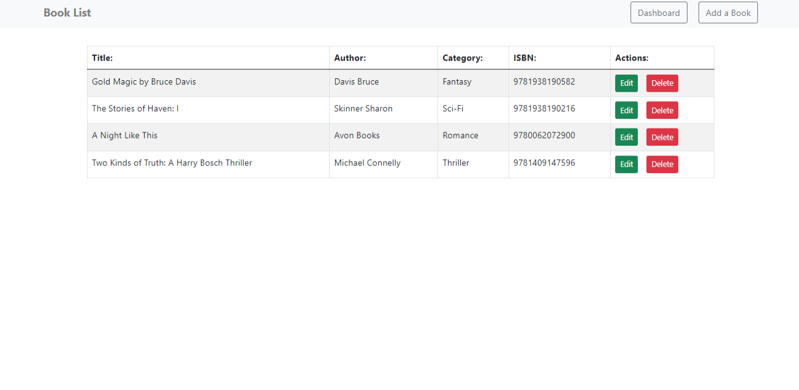
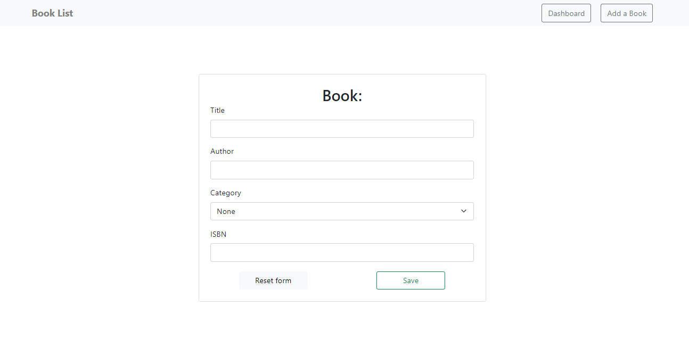

# Introduction

### *Book List using React.js*
This is a simple app to show book titles, authors,
categories and ISBNs. It has the following pieces:
add a book, edit and delete.

**Technical description:**
- hooks and custom hooks (useForm);
- Typescript;
- Bootstrap;
- fake [REST API](https://github.com/typicode/json-server).

## Screen:

## Quick-start instructions:
**In the client directory, you can run:**
### `npm run start`
Open [http://localhost:5000](http://localhost:5000) to view 
it in the browser.

**Runs the fake REST API:**
### `npm run dev`
Open [http://localhost:3000](http://localhost:3000) to view 
it in the browser.

________________

[LinkedIn](https://www.linkedin.com/in/olha-kostiv-84918421a/)
